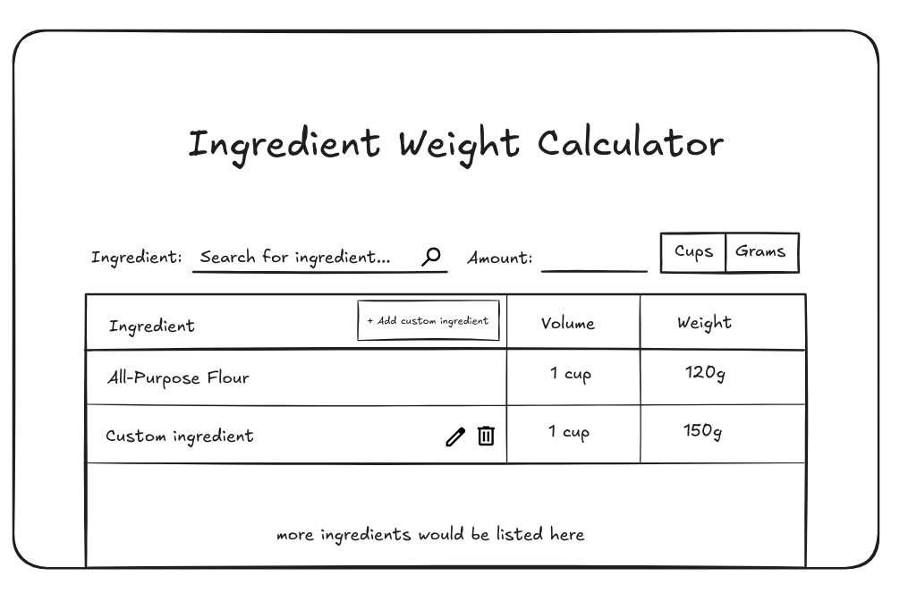
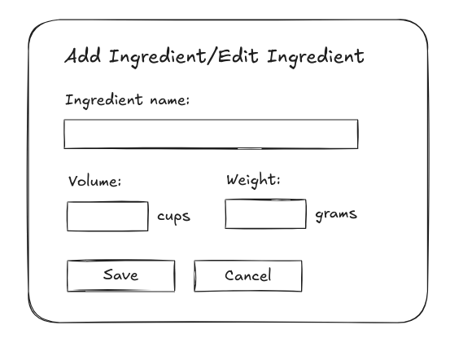

# RecipeWizard

## Overview

<!-- What is your app? Give a brief description in a couple of sentences. -->

RecipeWizard is an application that allows bakers to convert between cups and grams quickly and easily when measuring ingredients.

### Problem Space

<!-- Why is your app needed? Give any background information around any pain points or other reasons. -->

This app was inspired by an issue I had while baking. I use the Ingredient Weight Chart on the King Arthur Baking website all the time to convert cup measurements to gram measurements. Weight measurements are more accurate, and I can measure ingredients all in the same bowl so I don't have to wash multiple measuring cups. My issue was that the Ingredient Weight Chart only provided one example measurement for each ingredient (usually 1 cup), so I had to use a calculator to convert every measurement to the amount I needed. I wanted to make a version of the chart that I could use to calculate amounts as well.

### User Profile

<!-- Who will use your app? How will they use it? Add any special considerations that your app must take into account. -->

- Bakers:
  - wanting to bake using more accurate measurements
  - wanting to bake without access to measuring cups or a scale
  - trying to decide what weight of ingredients they need to buy at the store

### Features

<!-- List the functionality that your app will include. These can be written as user stories or descriptions with related details. Do not describe _how_ these features are implemented, only _what_ needs to be implemented. -->

- As a user, I want to be able to enter both decimal and fraction measurements
- As a user, I want to be able to search for the ingredients I need
- As a user, I want to be able to add custom ingredients
- As a user, I want to be able to edit and delete ingredients I've added

## Implementation

### Tech Stack

<!-- List technologies that will be used in your app, including any libraries to save time or provide more functionality. Be sure to research any potential limitations. -->

- React
- MySQL
- Express
- Client libraries:
  - react
  - axios
  - fraction.js
- Server libraries:
  - knex
  - express

### APIs

<!-- List any external sources of data that will be used in your app. -->

- No external APIs used

### Sitemap

<!-- List the pages of your app with brief descriptions. You can show this visually, or write it out. -->

- Ingredient weight chart (this website only requires one page)
  - Add, edit, and delete would probably work as pop-ups like the Delete function on the InStock project

### Mockups

<!-- Provide visuals of your app's screens. You can use pictures of hand-drawn sketches, or wireframing tools like Figma. -->

#### Home Page



#### Add and Edit popups



### Data

<!-- Describe your data and the relationships between the data points. You can show this visually using diagrams, or write it out. -->

A single table like the one shown in the mockup. Includes five fields: ID, ingredient name, volume, weight, and whether the ingredient is custom.

### Endpoints

<!-- List endpoints that your server will implement, including HTTP methods, parameters, and example responses. -->

**GET /ingredients**

- Get list of ingredients

Parameters: none

Response: All ingredients

**POST /ingredients**

- Add an ingredient

Parameters:

- name: Ingredient name
- volume: Ingredient volume in cups
- grams: Ingredient weight in grams

Response:

```
[
    {
        "id": 2,
        "name": "Custom ingredient",
        "volume": "1 cup",
        "grams": 150,
        "custom": true
    }
]
```

**PATCH /ingredients/:id**

- Edit an ingredient

Parameters:

- name: Ingredient name
- volume: Ingredient volume in cups
- grams: Ingredient weight in grams

Response:

```
[
    {
        "id": 2,
        "name": "Custom ingredient",
        "volume": "1 cup",
        "grams": 150,
        "custom": true
    }
]
```

**GET /ingredients/:id**

- Get a single ingredient

Parameters: none

Response:

```
[
    {
        "id": 1,
        "name": "All-Purpose Flour",
        "volume": "1 cup",
        "grams": 120,
        "custom": false
    }
]
```

**DELETE /ingredients/:id**

- Delete an ingredient

Parameters: none

Response: 200 OK

## Roadmap

<!-- Scope your project as a sprint. Break down the tasks that will need to be completed and map out timeframes for implementation working back from the capstone due date. -->

- Create client ✓

  - react project with routes and boilerplate pages ✓

- Create server

  - express project with routing, with placeholder 200 responses ✓

- Create migrations ✓

- Create seed with ingredient weight chart data ✓

- Feature: Search by ingredient ✓

- Feature: Enter grams ✓

- Feature: Enter decimal cups ✓

- Feature: Enter cups as a fraction ✓

- Feature: Add custom ingredient ✓

- Feature: Edit custom ingredient ✓

- Feature: Delete custom ingredient ✓

- Bug fixes

- DEMO DAY

## Future Implementations

<!-- Your project will be marked based on what you committed to in the above document. Here, you can list any additional features you may complete after the MVP of your application is built, or if you have extra time before the Capstone due date. -->

- Dark mode
- Images of ingredients
- Cups/tablespoons/teaspoons conversions
- Input validation

## Installation Instructions

### Frontend

- Clone this repo and open it in your terminal
- Run `npm install` to install the project
- Create a .env file in the project directory (see the included .env.sample file for an example)
- Run `npm run dev` and open the link provided in the terminal, e.g. http://localhost:5173

### Backend

- Clone the [backend repo](https://github.com/passportmidi/capstone-project-backend) and open it in your terminal
- Run `npm install` to install the project
- Create a .env file in the project directory (see the included .env.sample file for an example)
- Make sure MySQL is installed on your computer before running the following step
- Run `npx knex migrate:latest` and `npx knex seed:run` to create and populate the project database on your computer
- Run `npm start` to start the backend API server
